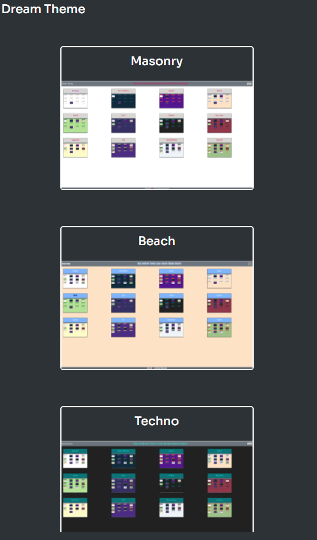
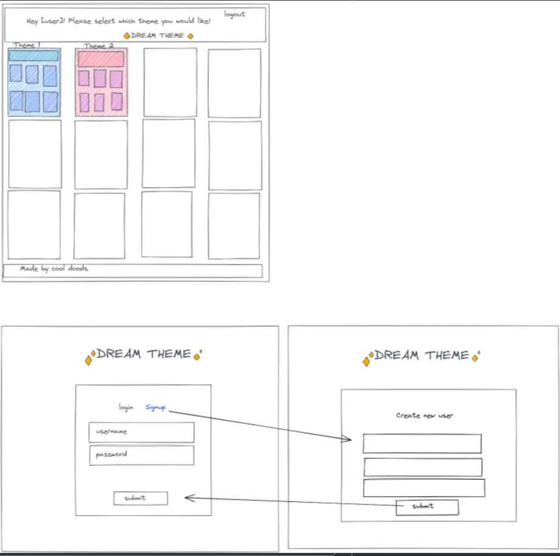
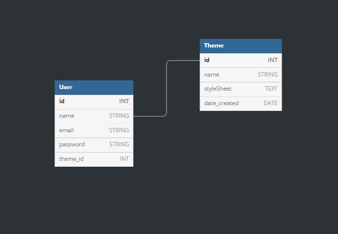

# 
*Dream Theme*

  This application generates themes dynamically using DreamTheme templates as the  source of the themes to provide mechanisms to manage those     themes and their 
  updates programmatically.

### 
*Getting Started*

    The Dream Theme wire-frame is a two-dimensional illustration of a page's interface that specifically focuses on it's space allocation and prioritization of content, functionalities available, and intended behaviors.

### 
*Dream Theme Wire-frame*

### A well-structured Wire-frame:

- Information design visually places and prioritizes elements for clear goals of the application and user

- Navigation design communicates the relationship between links to understand the applications options

- Interface design arranges and includes elements allowing user interact functionally with the application

### 
*Entity Relational Diagram*
 
A well-structured database:

- Saves disk space by eliminating redundant data.

- Maintains data accuracy and integrity.

- Provides access to the data in useful ways.

### Designing an efficient, useful database is a matter of following the proper process, including these phases:

- Requirements analysis
- Identifying the purpose of your database
- Organizing data into tables
- Specifying primary keys and analyzing relationships
- Normalizing to standardize the tables

[DreamTheme db](https://dbdiagram.io/d/6276f36c7f945876b6d4d41a)

### *Dependencies*

 - [GitHub](https://github.com/SFelbeck/DreamTheme)

 - [Masonry](https://mansonry.desandro.com/)

 - [GoogleFonts](https://fonts.google.com/)

 - [MkDocs](https://www.mkdocs.org/)

 - [Excalidraw](https://excalidraw.com)

 - [NPM](https://www.npmjs.com/)

 - [Bootstrap](https://getbootstrap.com)

 - [Insomnia](https://insomnia.rest)

 - [Heroku](https://www.heroku.com/)

 ## *Installing Features*

- An application  for the user interface automatically generated themes.
- Provide automated functionality to build the generated themes should the source of the template have changed
- Ingest external CSS and JS

# [Dream Theme](https://dreamtheme.herokuapp.com/login)

## *Authors*

- [Stefan Felbeck](https://sfelbeck.github.io/Portfolio_SFelbeck/) 

- [Andrew Noorishad](https://anoorishad.github.io/Personal-Portfolio/)

- [Jeff Evanson](https://github.com/jevanson22)

- [Andrew Baird](https://github.com/abairdster)

