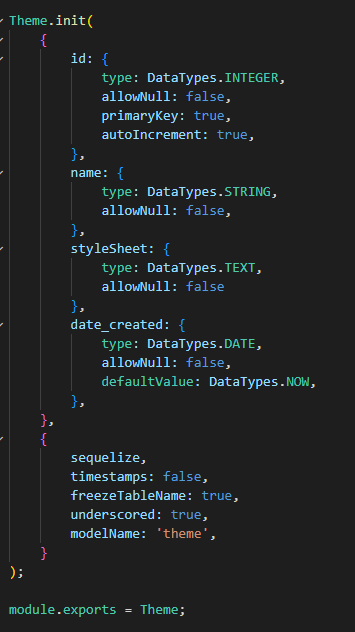
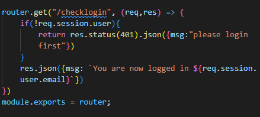

# 
*DreamTheme*

###### 
*snippet*

## 
*Description*

>The Theme Generator application generates themes dynamically using DreamTheme templates as the source of the themes, and to provide mechanisms to manage those themes and their updates programmatically.This application is designed for organizations who already have many existing websites, and need to simply port their existing templates to DreamTheme. 

###### 
*snippet*

### *Dependencies*

 - [GitHub](https://github.com/SFelbeck/DreamTheme)

 - [Masonry](https://mansonry.desandro.com/)

 - [GoogleFonts](https://fonts.google.com/)

 - [MkDocs](https://www.mkdocs.org/)

 - [Excalidraw](https://excalidraw.com)

 - [NPM](https://www.npmjs.com/)

 - [Bootstrap](https://getbootstrap.com)

 ## *Installing Features*

- An application  for the user interface automatically generated themes.
- Provide automated functionality to build the generated themes should the source of the template have changed
- Ingest external CSS and JS

## *Authors*

-[Stefan Felbeck](https://sfelbeck.github.io/Portfolio_SFelbeck/)

-[Andrew Noorishad](https://anoorishad.github.io/Personal-Portfolio/)

-[Jeff Evanson](https://github.com/jevanson22)

-[Andrew Baird](https://github.com/abairdster)

## *Credits*

